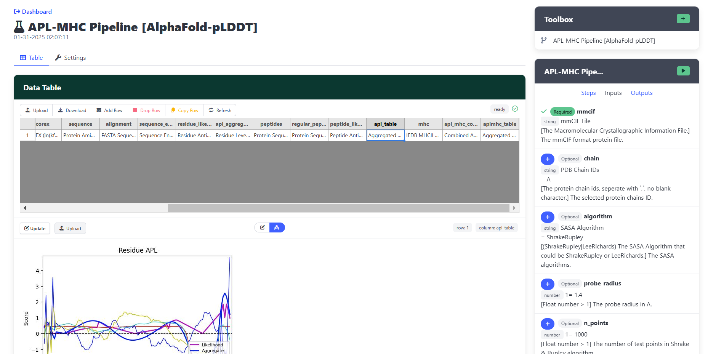

 

# (APLSuite) Antigen Processing Likelihood Standalone Application
`UPDATED: 2025/02/06`

Computational epitope prediction is a critical tool for exploring and understanding CD4+ T cell-mediated immune responses, a key aspect of adaptive immunity. While existing computational methods primarily focus on supervised learning approaches, they often overlook the essential role of antigen processing in determining binding specificity. To address this limitation, our group developed Antigen Processing Likelihood (APL), an algorithm that integrates crystallographic B-factor, solvent accessible surface area (SASA), hydrogen exchange protection factors (COREX), and sequence entropy. 



Here, we introduce APLSuite, a comprehensive and lightweight software suite designed to streamline APL-based epitope prediction. APLSuite integrates distributed RESTful API services, a Python client for data aggregation and processing, a data science tool for efficient epitope computation, and a user-friendly graphical user interface for non-coding users. It provides a seamless and efficient pipeline for APL calculation and epitope prediction that can be finished in minutes with GPU-acceleration, which has not been implemented by existed tools. This flexible and extensible software suite is deployable on desktop and cloud environments, offering both guided and customizable workflows to meet diverse research needs in immunology research and immunotherapy development.

**Supporting Components**  
These links point to supporting components, but there is no need to install them manually. Installing APLSuite will automatically include all required packages.
1. **EasyAPI**: Transform a wide range of algorithms to a universal RESTful API server.
   > [https://github.com/Jiarui0923/EasyAPI](https://github.com/Jiarui0923/EasyAPI)
   - **EasyAPI-APLSuite**: Provides entries for APL components and APL algorithm.
        > [https://github.com/Jiarui0923/EasyAPI-APLSuite](https://github.com/Jiarui0923/EasyAPI-APLSuite)
   - **EasyAPI-NCBIBLAST**: Provides entries for NCBI-API based BLAST service.
        > [https://github.com/Jiarui0923/EasyAPI-NCBIBLAST](https://github.com/Jiarui0923/EasyAPI-NCBIBLAST)
2. **EasyAccess**: Seamlessly connect to and interact with EasyAPI.
   > [https://github.com/Jiarui0923/EasyAccess](https://github.com/Jiarui0923/EasyAccess)
3. **CalTable**: A robust computational tool designed for interdisciplinary data processing.
   > [https://github.com/Jiarui0923/CalTable](https://github.com/Jiarui0923/CalTable)
   - **CalTable-Bio**: Supports better biological data view and edition for CalTable
        > [https://github.com/Jiarui0923/caltable-bio](https://github.com/Jiarui0923/caltable-bio)
4. **gpuCOREX**: gpuCOREX (GPU CORrelation with hydrogen EXchange protection factors) is an algorithm designed to compute comformational stability of a protein using GPUs.
   > [https://github.com/Jiarui0923/gpuCOREX](https://github.com/Jiarui0923/gpuCOREX)
5. **DocFlow**: Supports to create markdown documentation from Python code.
   > [https://github.com/Jiarui0923/DocFlow](https://github.com/Jiarui0923/DocFlow)

## Installation
The APL application is depended on Python 3.12. These are the steps to install it.
1. **Install Anaconda**
   To make it easier to manage the environments, we recommend to install anaconda.

   Please install it following: https://docs.anaconda.com/anaconda/install/

   After install anaconda, please create an environment following command:
   ```bash
   conda create -n APL python=3.12
   ```
   Press enter when it asks "Proceed ([y]/n)?"  
   Then, activate the environment:
   ```bash
   conda activate APL
   ```
2. **Install APL**
   Use following command to install `APL`:
   ```bash
   pip install git+https://github.com/Jiarui0923/APL.git
   ```
   The package will automatically solve and install all dependencies.
   
3. **Install Clustal-Omega**  
    Please follow the Clustal-Omega website instruction to install it: http://www.clustal.org/omega/

    Windows need to setup an environment variable:
    ```bash
    $env:CLUSTALO_PATH = "C:/Program Files (x86)/clustal-omega/clustalo.exe"
    ```
    This should point to the executable `custalo.exe file`
4. **First-run (Initialization)**
   After installation, input `apl` in the terminal / commandline and press enter will launch APL application.
   ```bash
   apl
   ```
   If it is the first run, it will finish some initilization steps. These steps are automatically, except the analytics agreement. It will ask for whether allow us to collect access data for research analytics purpose. Your choice will not affect the application usage.

   Then, the web page will be opened in your web broswer automatically after few seconds.
5. **Shutdown Application**
   Attention: closing the web page cannot terminate the application. Please go to the terminal/commandline where start APL and press `ctrl` + `c` to stop it.

## Launch Application
After the first-run, you could start the APP again following these steps:
1. Open your terminal/commandline (Windows user may need to open `Anaconda Prompt`).
2. Activate environment:
   ```bash
   conda activate APL
   ```
3. Run APL
   ```
   apl
   ```

## Potential Issues
**After installation, it still shows `apl` not found**  
> For windows users, if this error shows, please use
> `Anaconda Prompt` instead of your powershell/commandline.
> If the error persists, please re-install from the first step.

**When running APL pipline in the application, it shows "Job failed or did not complete" for BLAST step**  
> This is caused by BLAST API failing and limitation. Please try again. To have a better BLAST experience, we recommend you to install a local/self-host server version of BLAST. Please check the guideline for `Local BLAST` API installation.


## Extra Service Installation
There are advanced functions which is not provided in default due to easy-to-use consideration. For the detailed documentation, please check `EasyAPI`.
### Deploy Extra API Servers
1. Open terminal/commandline on the computer/server based on a folder where you want to storage the configuration file.
2. Install Anaconda following: https://docs.anaconda.com/anaconda/install/
3. Create environment and activate it:
   ```bash
   conda create -n aplapi python=3.12
   conda activate aplapi
   ```
4. Install the API server using command
   ```bash
   pip install easyapi easyapi-aplsuite --index-url https://jellyroll.cs.tulane.edu/pypi/simple/
   ```
5. Setup the configuration files
   1. `config.json`
    ```json
    {
            "server_name": "aplapis", // should be different for different servers
            "task_queue": {
                "layouts": [
                    {"cpu":1, "cuda":0},
                    {"cpu":1, "cuda":0} // Set to the total number of CPU and GPU.
                ]
            },
            "authenticator": {
                "type": "memory",
                "credentials": {
                    "dfgnksdj***": { // Set your customized API ID
                        "key": "dfdf0w0940*******", // Set your customized API Key
                        "access": ["*"]
                    }
                }
            },
            "iolib": {
                "file": "iolib.json"
            },
            "cache": {
                "type": "memory",
                "hash": "MD5"
            },
            "modules": [
                // Add modules you would like to be hosted by this server
                // Please check the documentation of the easyapi-aplsuite documentation.
            ],
            "analystics": "./janalytics.json"
        }
    ```
    2. `janalytics.json`
    ```json
        {
            "enable": true, // Set `false` if you want to reject the analystics data collection.
            "host": "https://jellyroll.cs.tulane.edu/jstat/",
            "timeout": 1,
            "record_host": true,
            "record_parameter": true,
            "record_signature": true
        }
    ```
6. Start server using command:
 ```bash
     uvicorn easyapi:app --host 0.0.0.0 --port 8001
 ```
7. Finally, add this server to your APL application.
     - Click `Resources`
     - Click `Add Resource`
     - Host is your server IP address with the port (`http://xxx.xxx.xxx.xxx:8001/`). If your deploy it on the same computer, it should be (`http://localhost:8001/`)
     - API ID and API Key is the customized one you setup in the `config.json`
### Local BLAST
The BLAST API requests are limited and highly possible to fail. Therefore, we provided a local version API.
It can be installed following these steps:
1. Install docker on the computer/server where you want to install BLAST service following: https://docs.docker.com/engine/install/
2. Install BLAST docker following https://github.com/ncbi/docker/blob/master/blast/README.md and compile uniref50 as the database for the BLAST: https://www.uniprot.org/help/uniref
3. Open terminal/commandline on the computer/server based on a folder where you want to storage the configuration file.
4. Install Anaconda following: https://docs.anaconda.com/anaconda/install/
5. Create environment and activate it:
   ```bash
   conda create -n aplblast python=3.12
   conda activate aplblast
   ```
6. Install the API server using command
   ```bash
   pip install easyapi easyapi-aplsuite --index-url https://jellyroll.cs.tulane.edu/pypi/simple/
   ```
7. Setup the configuration files
   1. `config.json`
   ```json
   {
        "server_name": "blast",
        "task_queue": {
            "layouts": [
                {"cpu":1, "cuda":0},
                {"cpu":1, "cuda":0} // Set to the total number of CPU.
            ]
        },
        "authenticator": {
            "type": "memory",
            "credentials": {
                "dfgnksdj***": { // Set your customized API ID
                    "key": "dfdf0w0940*******", // Set your customized API Key
                    "access": ["*"]
                }
            }
        },
        "iolib": {
            "file": "iolib.json"
        },
        "cache": {
            "type": "memory",
            "hash": "MD5"
        },
        "modules": [
            "aplsuite.blast"
        ],
        "analystics": "./janalytics.json"
    }
   ```
   2. `janalytics.json`
   ```json
    {
        "enable": true, // Set `false` if you want to reject the analystics data collection.
        "host": "https://jellyroll.cs.tulane.edu/jstat/",
        "timeout": 1,
        "record_host": true,
        "record_parameter": true,
        "record_signature": true
    }
    ```
8. Start server using command:
   ```bash
    uvicorn easyapi:app --host 0.0.0.0 --port 8001
   ```
9. Finally, add this server to your APL application.
    - Click `Resources`
    - Click `Add Resource`
    - Host is your server IP address with the port (`http://xxx.xxx.xxx.xxx:8001/`). If your deploy it on the same computer, it should be (`http://localhost:8001/`)
    - API ID and API Key is the customized one you setup in the `config.json`
  
## Cite
**APLSuite (API / WebUI)**:
1. _UnderReview_
2. Li, J., Landry, S. J., & Mettu, R. R. (2024, December). GPU Acceleration of Conformational Stability Computation for CD4+ T-cell Epitope Prediction. In 2024 IEEE International Conference on Bioinformatics and Biomedicine (BIBM) (pp. 191-196). IEEE.
    ```bibtex
    @inproceedings{li2024gpu,
    title={GPU Acceleration of Conformational Stability Computation for CD4+ T-cell Epitope Prediction},
    author={Li, Jiarui and Landry, Samuel J and Mettu, Ramgopal R},
    booktitle={2024 IEEE International Conference on Bioinformatics and Biomedicine (BIBM)},
    pages={191--196},
    year={2024},
    organization={IEEE}
    }
    ```
**APL Algorithm**:  
1. Mettu, R. R., Charles, T., & Landry, S. J. (2016). CD4+ T-cell epitope prediction using antigen processing constraints. Journal of immunological methods, 432, 72-81.
    ```bibtex
    @article{mettu2016cd4+,
    title={CD4+ T-cell epitope prediction using antigen processing constraints},
    author={Mettu, Ramgopal R and Charles, Tysheena and Landry, Samuel J},
    journal={Journal of immunological methods},
    volume={432},
    pages={72--81},
    year={2016},
    publisher={Elsevier}
    }
    ```
2. Bhattacharya, A., Lyons, M. C., Landry, S. J., & Mettu, R. R. (2022, August). Incorporating antigen processing into CD4+ T cell epitope prediction with integer linear programming. In Proceedings of the 13th ACM International Conference on Bioinformatics, Computational Biology and Health Informatics (pp. 1-10).
    ```bibtex
    @inproceedings{bhattacharya2022incorporating,
    title={Incorporating antigen processing into CD4+ T cell epitope prediction with integer linear programming},
    author={Bhattacharya, Avik and Lyons, Molly C and Landry, Samuel J and Mettu, Ramgopal R},
    booktitle={Proceedings of the 13th ACM International Conference on Bioinformatics, Computational Biology and Health Informatics},
    pages={1--10},
    year={2022}
    }
    ```
