 

# 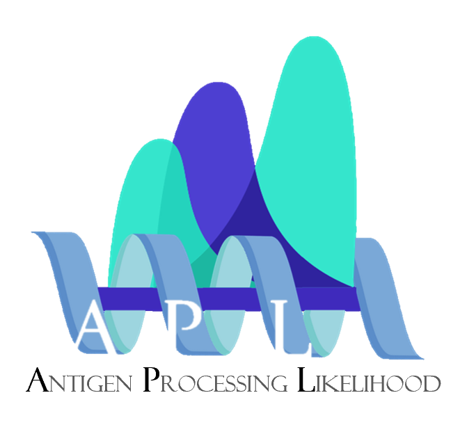  Antigen Processing Likelihood Server

`UPDATED: 2024/11/26, JIARUI LI`

This is a guideline for Antigen Processing Likelihood Server.

The Web URL is: https://jellyroll.cs.tulane.edu/tablex/projects/

Please follow these steps to start.

## 1. Registration
First, we need to register an account, please refer to account registration guideline.

## 2. Quick View
After login, the dashboard will be shown.

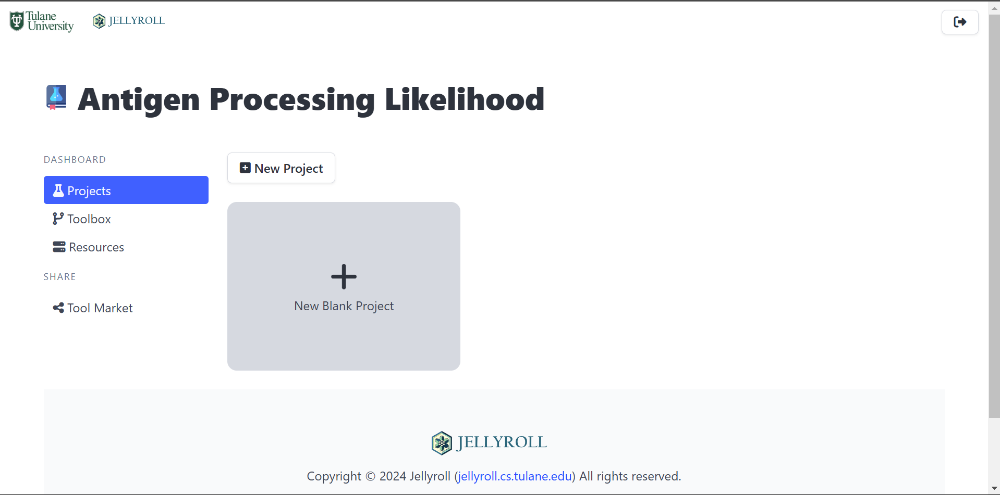

It comprises 4 sections including `Projects`, `Toolbox`, `Resources`, and `Tool Market`.

- `Projects`: Each running will be stored as a project and shown here as cards
- `Toolbox`: Each available tool will be here. And user can edit them.
- `Resources`: Manage all computational resources (servers).
- `Tool Market`: Search/Add shared tools.

## 3. Add Resource
**This step only needs to be finished once.**

Before start, the resource required to be added first. The server connection information should be provided by service provider.

- Click `Add Resource`
    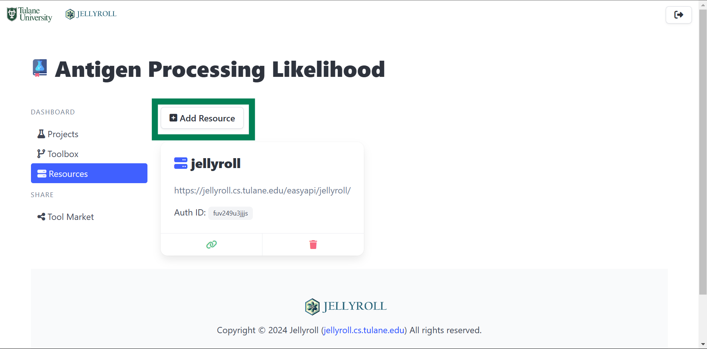

- Fill server information and then click `Create`
    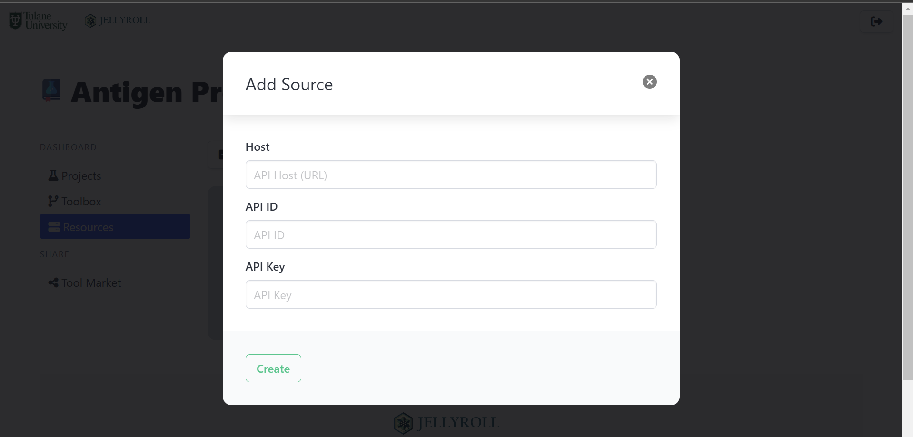

Then, the server should be added to your account and automatically used by each running.

Notice: There may be not only one resource/server. User could repeat this step to add more servers

## 4. Select Tool from Market
**This step only needs to be finished once.**

Go to `Tool Market` section.

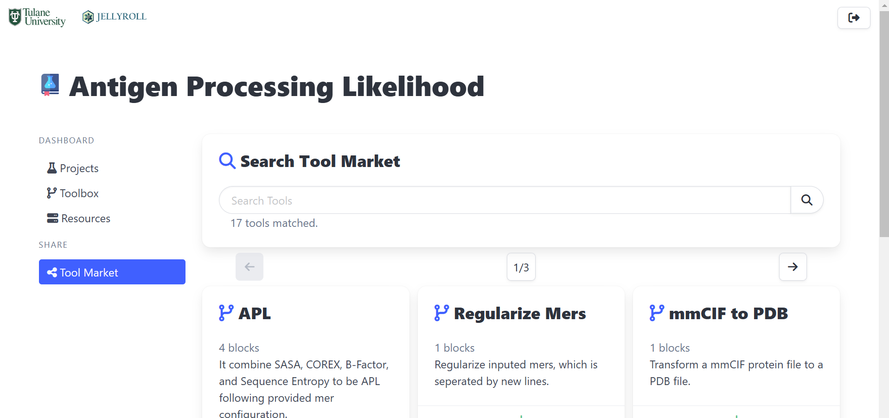

All shared tool is available here.

We use pure APL as an example here. (Notice: `APL` is only for parameter combination step. The entire `APL pipeline` from PDB file to APL results is provided by `APL Pipeline`)

First, search `APL Pipeline`
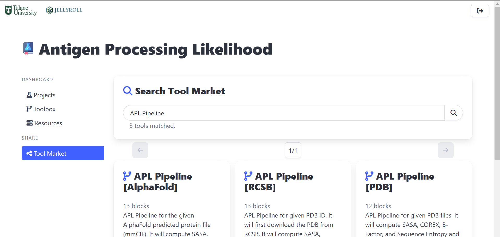

There are different `APL Pipeline`.
- `APL Pipeline [PDB]`: Upload PDB files and compute APL for them.
- `APL Pipeline [RCSB]`: Download PDB from RCSB with provided PDB ID and compute APL for them.
- `APL Pipeline [AlphaFold]`: Accept AlphaFold predicted proteins (mmCIF) files and compute APL.

Click the `+` symbol at the bottom of the card can add this tool to your toolbox.

Let's add `APL Pipeline [PDB]` as example. After click `+`, it will automatically redirect to the copied tool edit page.

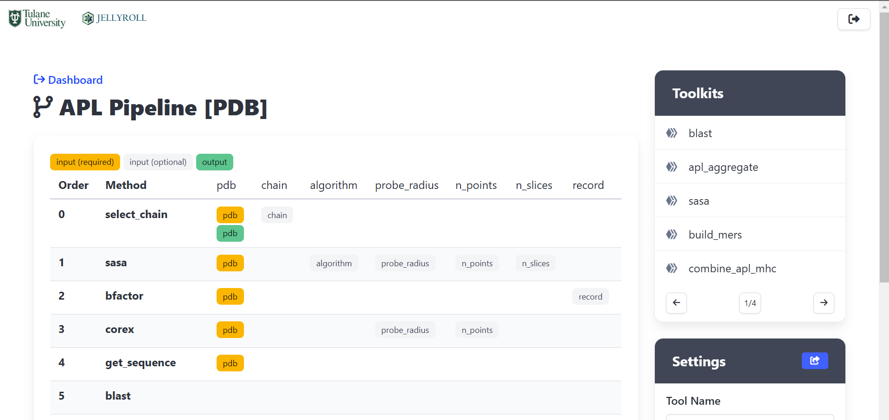

User could edit this tool here (this only edits your copy, not the tool market one).

## 5. Quick Start a Tool
Then, click `dashboard` at the left-up corner, we could go back to dashboard.

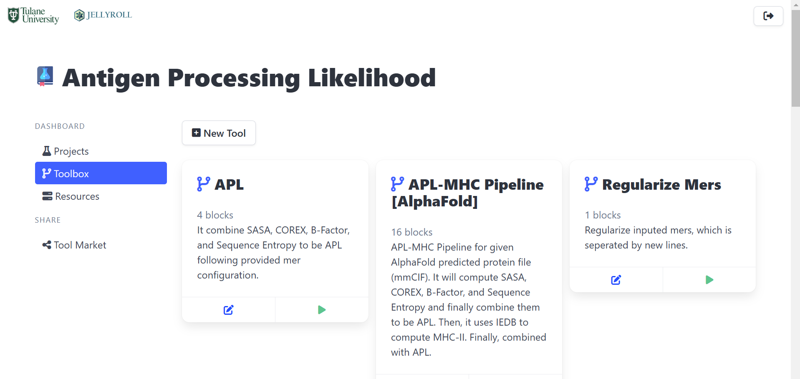

Then, click the green triangle of the selected tool, could start quick-start program, which is a guided running mode.

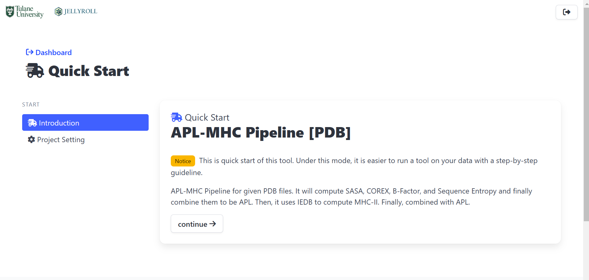

Click `continue`, user could setup the name and description for this running, or leave it as default.

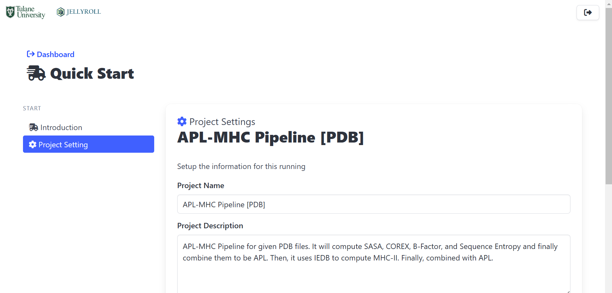

Then, user could upload the PDB files and parameter tables.

- Click `Upload Files`
    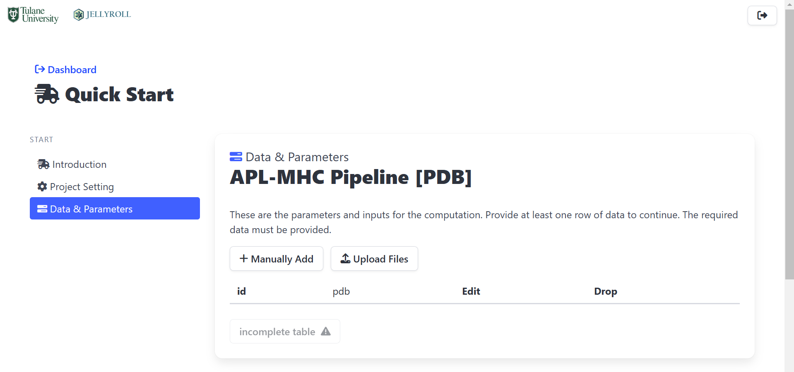
- Upload PDB files. (User can add file multiple times)
    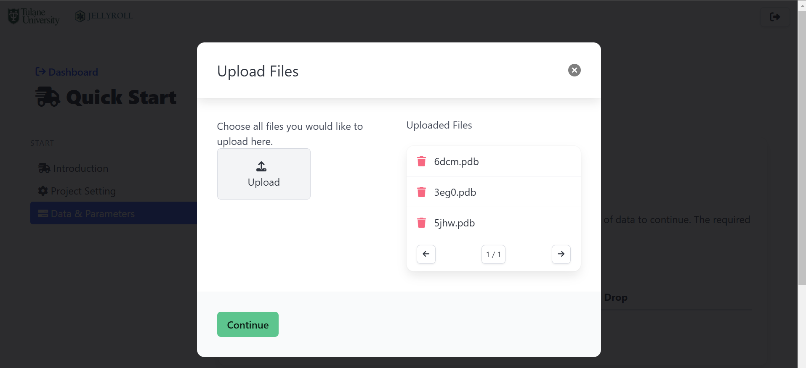
- Select output column. (file name should go pdb_id column and file data should go to pdb column. Click the button next to the input box can switch to input mode.) The input should following the screenshot.
    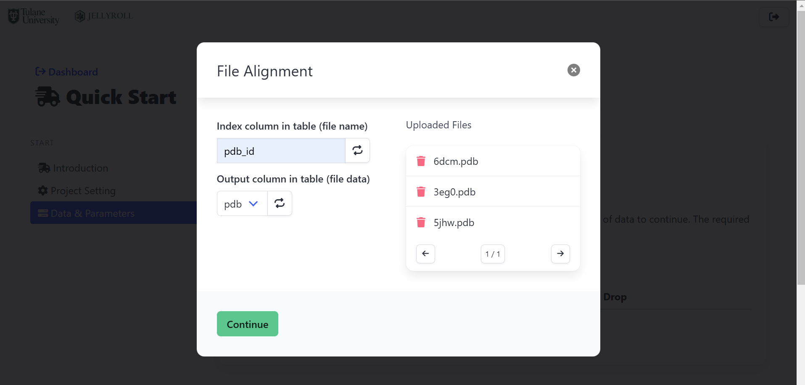

The next steps for data upload is optional, you could directly click `continue` to next step here.

> **Optional Steps for Paramter Customization**  
> This section also allows to upload a CSV file with a column called `pdb_id` to customize paramter or add comment.
> 
> This is an example CSV
> ```csv
> antigen,pdb_id,comment,sconf_weight
> Plasminogen,6dcm,need experiment,0.5
> GDF 11,5jhw,just test,
> ABL1,3eg0,,0.5
> ```
> 
> |antigen|pdb_id|comment|sconf_weight|
> |-------|------|-------|------------|
> |Plasminogen|6dcm|need experiment|0.5|
> |GDF 11|5jhw|just test||
> |ABL1|3eg0||0.75|
> 
> Each row will be matched to the PDB file row with the same pdb_id.
> 
> - Click `upload files` and only upload this CSV file.
>     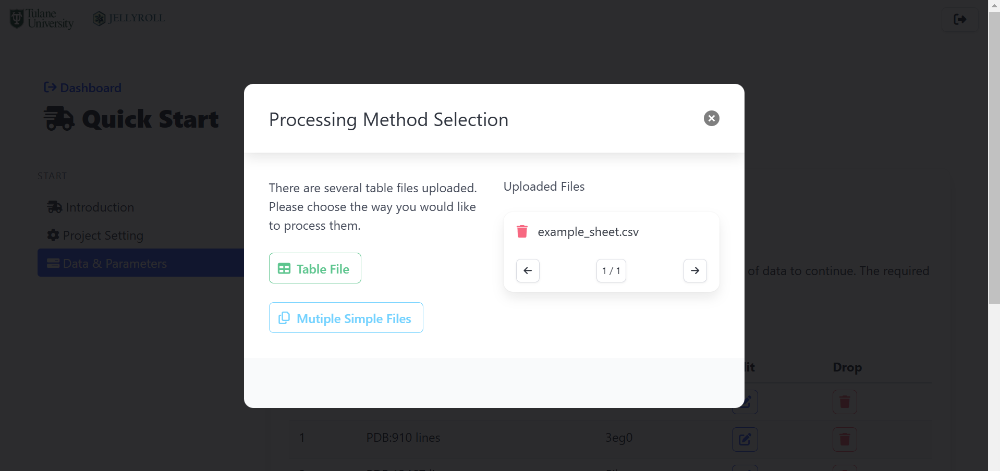
> - Choose `Table File` and input index column as pdb_id
>     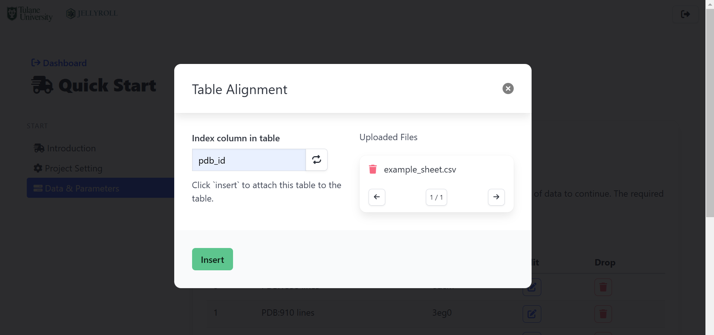


- Click `start` to start or customize other paramter then click `start`.
    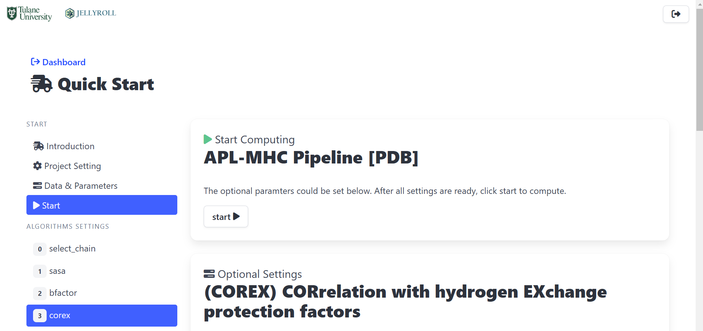

## 6. View Result & Download
Then, it will automatically redirect to the project page.
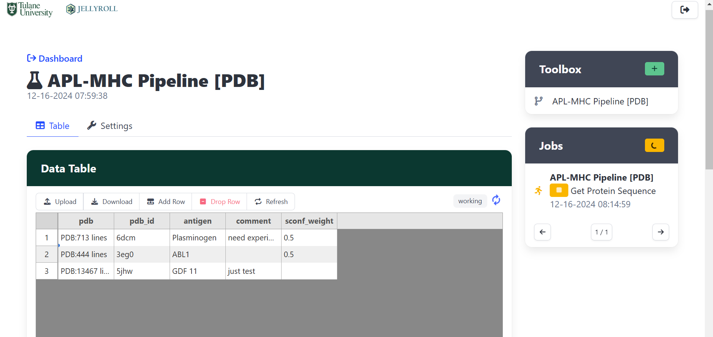
The `Jobs` section will show current running project and its progress/status.

User could close brower/computer and go back later. No need to wait until it is finished.

### Visual Result Unit
Click the cell of the table could visualize/edit the cell.
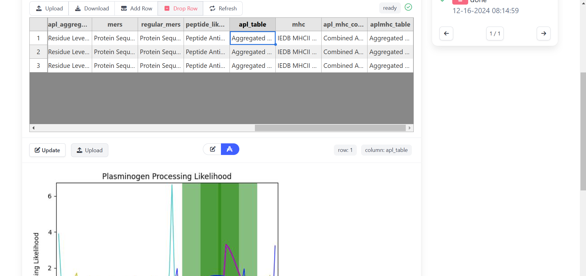

Click the switch button could switch between visulization and editor.

### Download
Click download button can start to download the result.
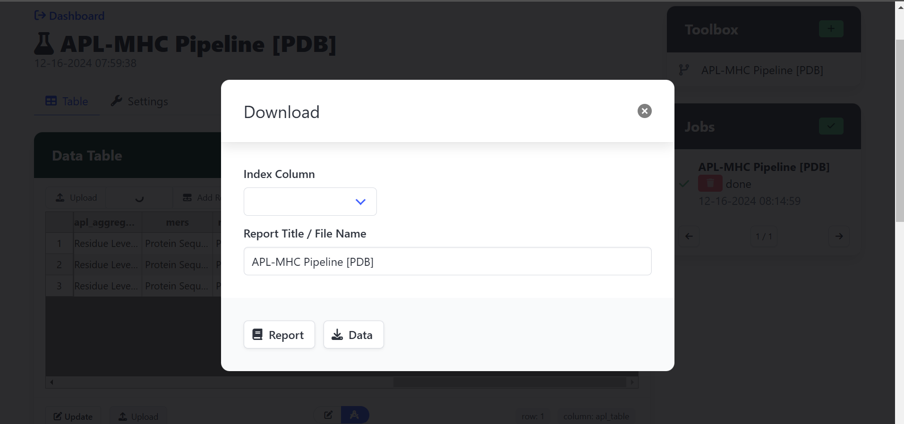
Leave `Index Column` blank, it will use row number as each line name. Or user could select a column as name (e.g. antigen)

- Click `Report` will generate a HTML report for entire project, which could be viewed by brower and print as PDF.
- Click `Data` will download a ZIP file contains all data.